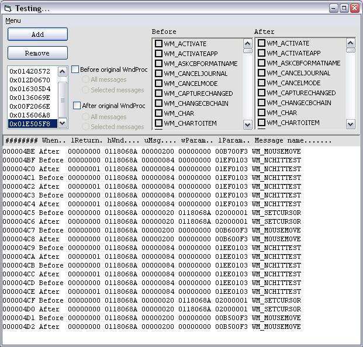



## Advanced Subclasser

### Description

This code uses Paul Caton's subclassing assembly code, but extends it to allow any number of objects to subclass the same hwnd. It is fast and memory effecient, and is easy to use. Included is a bare-bones example and an more thorough testing tool.
 
### More Info
 

             |
---                |---
**Submitted On**   |2005-02-21 13:02:30
**By**             |[selftaught](https://github.com/Planet-Source-Code/PSCIndex/blob/master/ByAuthor/selftaught.md)
**Level**          |Advanced
**User Rating**    |5.0 (40 globes from 8 users)
**Compatibility**  |VB 6\.0
**Category**       |[Miscellaneous](https://github.com/Planet-Source-Code/PSCIndex/blob/master/ByCategory/miscellaneous__1-1.md)
**World**          |[Visual Basic](https://github.com/Planet-Source-Code/PSCIndex/blob/master/ByWorld/visual-basic.md)
**Archive File**   |[Advanced\_S1855972212005\.zip](https://github.com/Planet-Source-Code/selftaught-advanced-subclasser__1-59074/archive/master.zip)

